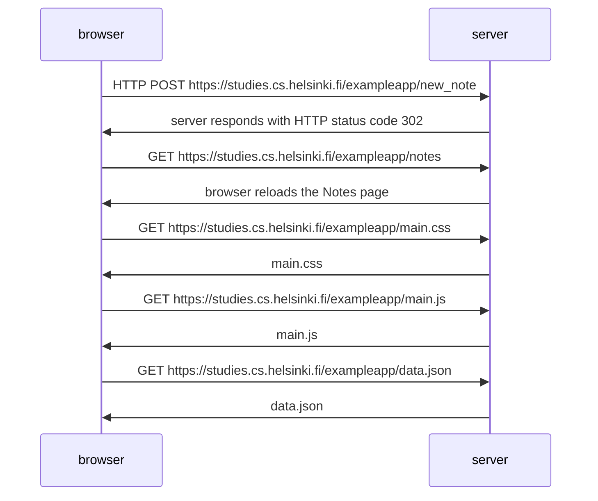

```mermaid
sequenceDiagram
    participant browser
    participant server

    browser->>server: HTTP POST https://studies.cs.helsinki.fi/exampleapp/new_note
    server->>browser: server responds with HTTP status code 302
    browser->>server: GET https://studies.cs.helsinki.fi/exampleapp/notes
    server->>browser: browser reloads the Notes page
    browser->>server: GET https://studies.cs.helsinki.fi/exampleapp/main.css
    server->>browser: main.css
    browser->>server: GET https://studies.cs.helsinki.fi/exampleapp/main.js
    server->>browser: main.js
    browser->>server: GET https://studies.cs.helsinki.fi/exampleapp/data.json
    server->>browser: data.json
```
